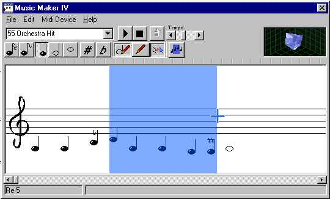



## Music Composer IV \(Link Fixed\)

### Description

Music composer is a Sound authoring tool to compose melodies that suit your pleasure. Although in the prime faces of it's life, music composer is quite advanced and may be also be used by professional musicians

Music Composer Capabilities:

o Compose music with over 200 instruments

o Play it back any time

o Place 5 different note lengths (from semi-o quaver to whole note)

o Save in txt format

o Transposition Up/Down

o Display of placed note's name

o Up to 150 notes

Get it from this URL:

http://www.angelfire.com/bug/vbsource/
 
### More Info
 

             |
---                |---
**Submitted On**   |2003-07-11 11:51:12
**By**             |[Lefteris Eleftheriades](https://github.com/Planet-Source-Code/PSCIndex/blob/master/ByAuthor/lefteris-eleftheriades.md)
**Level**          |Advanced
**User Rating**    |4.8 (19 globes from 4 users)
**Compatibility**  |VB 6\.0
**Category**       |[Sound/MP3](https://github.com/Planet-Source-Code/PSCIndex/blob/master/ByCategory/sound-mp3__1-45.md)
**World**          |[Visual Basic](https://github.com/Planet-Source-Code/PSCIndex/blob/master/ByWorld/visual-basic.md)
**Archive File**   |[Music\_Comp1613757132003\.zip](https://github.com/Planet-Source-Code/lefteris-eleftheriades-music-composer-iv-link-fixed__1-46866/archive/master.zip)

